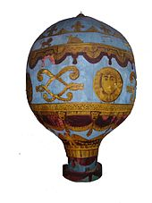
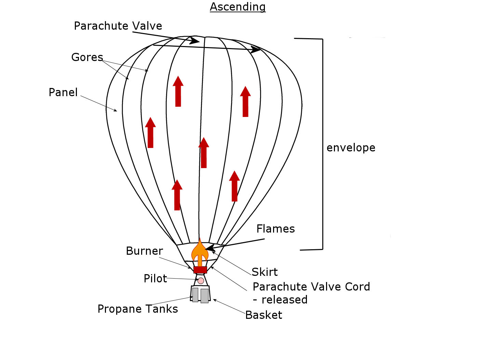
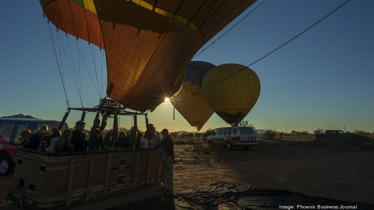
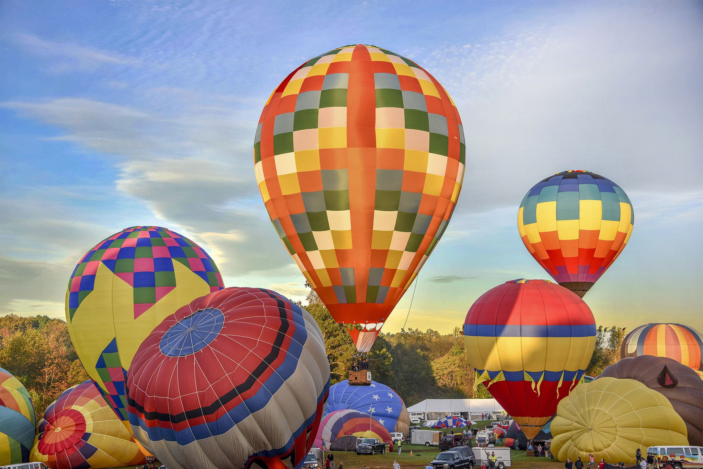
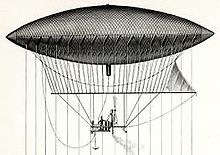
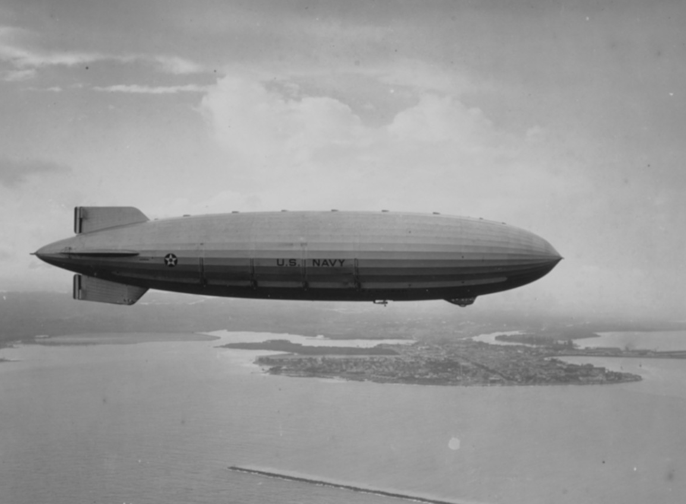
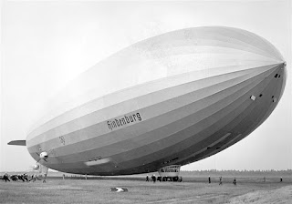
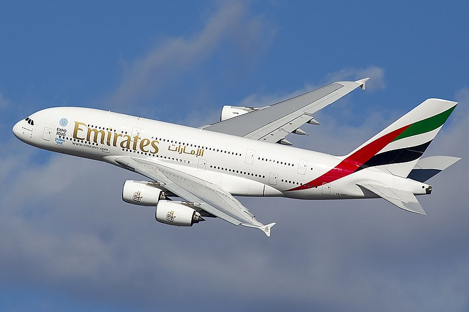

<head><link rel='stylesheet' href='../assets/style.css'></head>

# Capitolul 1. Aerostatul

## 1.1 Introducere

Aerostatul a fost conceput după ideea balonului cu aer cald, care la timpul său a fost conceput după principiul de funcționare unei simple lanterne cu aer cald inventată în China, toate având la bază principiul lui Arhimede.

## 1.2 Balonul cu aer cald

::: figure

**Fig 1.1** Primul balon cu aer cald al fraților Montgolfier. Model din muzeul de știință din Londra.

[https://en.wikipedia.org/wiki/File:Montgolfier_Balloon.JPG]
:::

Ideea de balon cu aer cald sau cu alt gaz mai ușor ca aerul în istorie apare încă din anii 1700, însă primul balon cu aer cald *fig. 1.1* fără echipaj și alte echipamente a fost prezentat în Franța de frații *Montgolfier* pe 19 septembrie 1783, zborul a durat 10 min. Primul zbor cu participarea omului, a fost un zbor *legat* și a avut loc în jurul lunii octombrie 1783.

### 1.2.1 Construcția

Baloanele cu aer cald se bazează pe un principiu științific foarte simplu: aerul mai cald se ridică în aer mai rece. În esență, aerul cald este mai ușor decât aerul rece, deoarece are mai puțină masă pe unitatea de volum. Acest principiu permite ca balonul să stea în aer plutind. În comparație cu un avion, balonul cu aer cald nu necesită aripi și viteză pe direcția de zbor pentru a menține înălțimea stabilă. Având un principiu simplu de funcționare, are și o construcție tot atât de simplă.

::: figure

**Fig 1.2** Balonul cu aer cald. Componente.

[https://natashadesignandsurvive.files.wordpress.com/2014/10/ascending1.jpg]
:::

Este confecționat din 3 componente principale:

- *Balonul / Camera de gaz* - este în forma unei picături, este deschis la baza prin care intră flacăra arzătorului, în apropierea acestuia este realizat din material rezistent la foc. Are rolul de a menține aerul cald și a efectua tracțiunea aeronavei.
- *Arzătorul* - este un echipament cu ardere deschisă, este situată pe axa verticală a aeronavei la intrarea inferioară a balonului, utilizează gaz propan și are rolul de a încălzi aerul din camera de gaz.
- *Gondola* - este un coș de răchită, este de tip deschis ranforsat cu un cadru pe care se poziționează arzătorul. Pot fi întâlnite și baloane cu aer cald cu capsulă în loc de gondolă, ele fiind de altitudine mai mare și cu securitate mai ridicată. Gondola are rolul de a transporta baloanele de gaz cu propan pentru arzător și pasagerii.

### 1.2.2 Modul de funcționare

Modul de funcționare a *balonului cu aer cald* poate fi explicat în următorii pași:

Observație: *Baloanele cu aer cald fiind aeronave cu o forță de tracțiune mică și un control dificil, necesită condiții meteo foarte bune. Nu se recomandă zborul în timpul furtunii și a vânturilor puternice. Trebuie desfăcut la un loc deschis fără copaci, clădiri sau alte construcții de care se poate agăța balonul.*

1. Utilizând arzătorul asamblat la gondolă, se umflă balonul cu aer încălzit de flacăra acestuia. Procesul dat poate dura de la 10 până la 20 min, depinde de volumul camerei de gaz.
2. Decolarea și zborul este datorat diferenței de densitate a aerului din afara balonului și a aerului încălzit din interiorul camerei de gaz
3. Ridicarea balonului este controlată de pilot, care mărește intesitatea flacărei.
4. Coborârea este efectuată prin două metode, directă și indirectă:
   - *Directă* - (dorită), prin evacuarea aerului cald cu ajutorul clapetei din vârful balonului și înlocuirea cu aer rece care intră prin partea inferioară a balonului.
   - *Indirectă* - (nedorită), prin răcirea în timp a aerului din interior.
5. Controlul direcției de zbor este efectuată de o pânză din același material prinsă de balon și de cadrul gondolei care este controlată de pilot astfel stabilind direcția zborului.

### 1.2.3 Utilizarea

Baloanele cu aer cald sunt utilizate în mod obișnuit în scopuri recreative. Pe lângă zborurile liniștite de dimineață sau de după-amiază, sunt organizate zboruri prin țară pentru a admira priveliștea, pentru poze și amintiri plăcute. Chiar și pentru așa aeronave lente există evenimente sportive competitive în care se încearcă stabilirea a noilor recorduri. Sunt oameni care își confecționează propriile baloane în diferite forme în scop de hobby. Adeseori sunt organizate lansarea a mai multor baloane împreună fără niciun obiectiv competitiv. Zborurile pot dura în general de la o oră până la trei și pot parcurge câțiva kilometri, deși adesea piloții preferă aterizarea în apropierea de punctul de decolare.

::: figure

**Fig 1.3** Utilizarea balonului cu aer cald în scop turistic

[https://media.bizj.us/view/img/12199850/balloonride09*750xx4184-2354-0-218.jpg]
:::

::: figure

**Fig 1.4** Cursa "iepuri și câini"

[https://i.pinimg.com/originals/bf/bf/19/bfbf198fb48968ea5e1315bb40428884.jpg]
:::

Competițiile cu baloane pot consta doar din câteva baloane pentru o ieșire de o zi sau până la câteva sute de baloane pentru un festival de o săptămână. Evenimentele competitive includ *parcurgerea unei distanțe într-un interval de timp*, *aterizarea în țintă* și cursele *"iepuri și câini"*. Cursele de *iepuri și câini* sunt ușor de organizat și judecat, deoarece necesită un singur balon cu rol de iepure (iepure de câmp) care se lansează primul și parcurge o distanță rezonabilă. Concurenții încearcă să aterizeze cât mai aproape de locația de aterizare a iepurilor. La festivale mari cu aglomerație de sute de baloane participante, pentru a evita cazuri nedorite sunt aruncate marcaje care simulează aterizările și se recomandă ca baloanele cu rol de *"iepure"* să zboare spre locații mai deschise.

## 1.3 Evoluția baloanelor cu aer cald. Alte gaze

Înainte de zborul balonului cu aer cald, în august 1783 a avut loc primul zbor a balonului cu gaz proiectat de Jacques Charles și Les Frères Robert fără pasageri sau marfă. Al doilea zbor al balonului cu gaz, umplut cu hidrogen, pilotat de Jacques Charles și Nicolas-Louis Robert a avut loc la 10 zile după ce a avut loc primul zbor cu echipaj al balonului cu aer cald al fraților Montgolfier.

După marele succes al balonului cu gaz, Jacques Charles și frații Robert își propun următorul proiect îmbunătățirea construcției. Modifica forma și trec la o ambarcațiune alungită orientabilă propusă de Jean Baptiste Meusnier, pentru a concepe un balon dirijabil. Camera de gaz a suferit și ea modificări în care au fost încorporate baloane interne (celule de aer) pentru controlul volumului interior, o cârmă și o metodă de propulsie. Pe 19 septembrie 1784, frații Robert și M. Collin-Hullin au zburat timp de 6 ore și 40 de minute, parcurgând 186 km de la Paris până la Beuvry, lângă Béthune, acesta fiind primul zbor de peste 100 km înregistrat.

Pe lângă hidrogen, au fost confecționate și baloane dirijabile care utilizau heliu. Fiind un gaz mult mai eficient ca aerul cald însă nu așa de eficient ca hidrogenul, oricum a fost folosit din motive de siguranță fiind un gaz neinflamabil.

## 1.4 Apariția primul aerostat

### 1.4.1 Dezvoltarea aerostatelor

Lucrările la dezvoltarea unui balon dirijabil (direcabil), numit în zilele noastre dirijabil, au continuat sporadic pe tot parcursul secolului al XIX-lea. Se crede că primul zbor susținut cu motor și controlat din istorie a avut loc pe 24 septembrie 1852, când Henri Giffard a zburat aproximativ 27 km în Franța de la Paris la Trappes cu dirijabilul Giffard fig. 1.5, un dirijabil nerigid umplut. cu hidrogen și propulsat de un motor cu abur de 3 cai putere (2,2 kW) care conduce o elice cu 3 pale. [https://en.wikipedia.org/wiki/Early_flying_machines]

::: figure

**Fig. 1.5** Balonul dirijabil dezvoltat de Henri Giffard

[https://en.wikipedia.org/wiki/Early_flying_machines]
:::

În 1863, Solomon Andrews a zburat cu designul său *Aereon*, un dirijabil fără motor și controlabil în Perth Amboy, New Jersey. A zburat mai târziu în 1866 în jurul orașului New York și până la Oyster Bay, New York. Tehnica sa de alunecare sub gravitație funcționează prin schimbarea liftului pentru a oferi forță de propulsie pe măsură ce dirijabilul se ridică și se scufundă alternativ și, prin urmare, nu are nevoie de un motor. [https://en.wikipedia.org/wiki/Early_flying_machines]

Succesul și entuziasmul inginerilor aduce la dezvoltarea baloanelor dirijabile de forme mai alungite, cu carcase rigide, cu capacitate mai mare care puteau ridica și menține în zbor toane de marfă și echipaje de pe 50 de persoane pe timp mai mare decât cateva ore.

::: figure

**Fig. 1.6** LZ 127 Graf Zeppelin

[https://en.wikipedia.org/wiki/LZ_127_Graf_Zeppelin]
:::

Un dirijabil modern după timpurile de atunci este *LZ 127 Graf Zeppelin* fig. 1.6 a fost o aeronavă rigidă germană care transporta pasageri, plină cu hidrogen, care a zburat din 1928 până în 1937. A oferit primul serviciu de zbor transatlantic comercial de pasageri. Numit după pionierul dirijabilului german Ferdinand von Zeppelin, conte în nobilimea germană, a fost conceput și operat de Dr. Hugo Eckener, președintele Luftschiffbau Zeppelin.
[https://en.wikipedia.org/wiki/LZ_127_Graf_Zeppelin]

### 1.4.2 Impactul aerostatelor în război

Aerostatele au jucat un rol important în primul război mondial. Au fost folosite pentru bombardare din aer, la trasportul avioanelor direct în zona roșie, trasportarea mărfurilor și a soldaților. Cât SUA, atât și Germania nazistă au investit bani în construcția aeronavelor de tip balon dirijabil datorită viziunilor sale în câștigul războiului datorită eficienței acestora. Pe partea de SUA, unul din acesta a fost *USS Akron ZRS-4* fig. 1.7 și pe partea Germaniei, aerostatul *Hindenburg* fig. 1.8.

::: figure

**Fig 1.7** USS Akron (ZRS-4) zburând din Zona Canalului Panama, 15 martie 1933

[https://www.history.navy.mil/content/history/nhhc/browse-by-topic/exploration-and-innovation/airships-dirigibles/_jcr_content/body/media_asset/image.img.jpg/1590780095129.jpg]
:::

### 1.4.3 Aerostatul Hindenburg

#### 1.4.3.1 Istoria

În timpul Primului Război Mondial, germanii au obținut un succes moderat în operațiunile de bombardare cu rază lungă de acțiune cu dirijabilul rigid de tip zeppelin, care putea atinge altitudini mai mari decât avioanele disponibile atunci. De două ori în 1917, zeppelinii germani au efectuat zboruri cu o durată de aproape 100 de ore. Astfel de performanțe i-au făcut pe mulți oameni să creadă că dirijabilele mari vor juca un rol important în dezvoltarea aviației. O serie de zeppeline au fost distribuite țărilor aliate ca parte a reparațiilor postbelice ale Germaniei.

Dirijabil german numit Hindenburg fig. 1.8, a fost cel mai mare dirijabil rigid construit vreodată. A fost construit după design convențional zeppelin. A fost lansat la Friedrichshafen, Germania, în martie 1936 și a fost primul dirijabil care a inaugurat serviciul aerian comercial peste Atlanticul de Nord transportând 1.002 de pasageri în 10 călătorii programate dus-întors între Germania și Statele Unite. Deși a fost proiectat pentru heliu, a fost umplut cu hidrogen din cauza restricțiilor de export impuse de Statele Unite împotriva Germaniei naziste.

::: figure

**Fig 1.8** Hindenburg. Germania Nazistă 1930

[https://1.bp.blogspot.com/-tOI6XvzTC5M/T6m0awZPY3I/AAAAAAAAANY/87CTdAORc0M/s320/pb-120504-hindenburg-09_photoblog900.jpg]
:::

Având o popularitate sporită a fost folosit pentru propaganda nazistă având pe stabilizatoarele din spate simbolistica nazistă. În data de 4 mai 1937 dirijabilul Hindenburg a luat foc și a fost distrus. În acest dezastru au murit 99 de persoane, din care pasagerii și echipajul acestuia. Ipoteza fiind scurgerea hidrogenului în atmosferă din cauza activiștilor anti-naziști care au sabotat dirijabilul. Această tragedie a pus punct în dezvoltarea dirijabilelor, ca fiind nesigure și pe lângă eficiența de trasport cu care nu se putea compara nici un avion, viteza de zbor era prea mică pentru trasportul rapid de pasageri și marfă care a jucat împotriva viitorului acestor aeronave.

#### 1.4.3.2 Parametrii fizici

::: table
|Parametru|Date / Valoare [U.M.]|OBS.|
|---|---|---|
|Model|Zeppeline||
|Structura|Rigidă||
|Tip|Transportul de pasageri||
|Greutate|118000 (kg)|greutatea aeronavei golă|
|Echipaj|61||
|Pasageri|50|după a fost modificat la 72 pasageri|
|Greutatea utilă|60000 [kg]||
|Lungime|246.7 [m]||
|Diametru|41.2 [m]||
|Construcția|15 inele principale, care legau 36 grinzi longitudinale|fiecare avea o chilă triunghiulară la fundul carenei|
|Control|Manual și "auto pilot"|pilot automat - busolă giroscopică ce controla cârma, menținea nava pe curs și altitudine atribuite în timpul croazierei pe vreme stabilă|
|Viteza maximă|135 [km/h]|
|Viteza croazieră|126 [km/h]|
|Motoare|4 motoare tip LOF-6 (DB-602)|1320 CP la 1650 RPM (putere maximă)|
|Elice motoare|material - lemn, cu 4 pale|$\phi 19.7"$, create din 2 elice cu câte 2 pale|
|Gaz proiectat|Heliu|A fost proiectat cu gaz heliu pentru siguranță|
|Gaz utilizat|Hidrogen|A fost utlizat din cauza sancțiunilor de export|
|Volumul total|200000 [m${}^3$]||
|Celule de gaz|16|Cu 16 supape manuale și 16 automate|
|Material celule|din bumbac, impregnată cu oxid de fier și acetat butirat de celuloză, amestecată cu praf de aluminiu|
:::

## 1.5 Comparatia cu alte tipuri de vehicule

### 1.5.1 Terestre

### 1.5.2 Acvatice

### 1.5.3 Aeriene

::: table
Tabel 4. Caracteristicele principale

|Parametru|Detalii|
|---|---|
|Echipaj|2 (cockpit)|
|Pasageri|575 și 853 maxim|
|Capacitate|175.2 [m${}^3$]|
|Greutate utilă|84000 [kg]|
|Lungime|72.72 [m]|
|Wingspan|79.75 [m]|
|Lățime| 7.14 [m]|
|Înălțime| 24.09 [m]|
|Greutate aeronavă| 285000 [kg]|
|Capacitate combustibil| 323546 [litri]|
|Viteza de cruazieră| 903 km/h / Mach 0.85|
|Distanță| 14800 [km]|
|Viteza de decolare|256 [km/h]|
:::

::: figure

**Fig. 1.** Airbus A380

[https://en.wikipedia.org/wiki/Airbus_A380#Passenger_provisions]
:::

### 1.5.4 Concluzie. Eficienta

## 1.6 Dezvoltarea aerostatelor în zilele noastre. Concepte. Viitorul acestora
