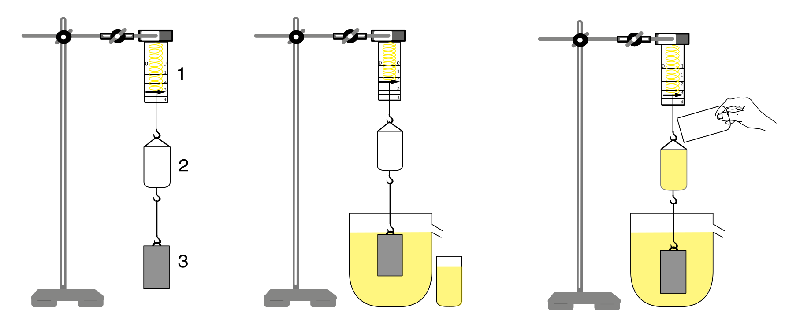
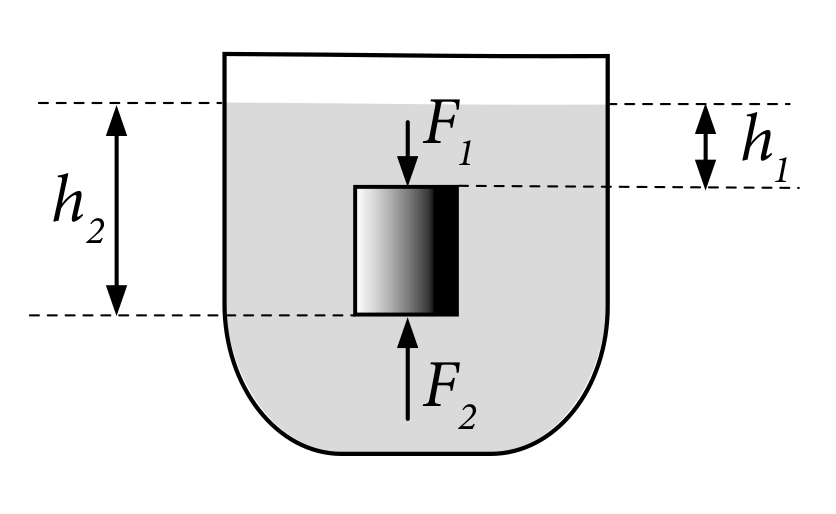
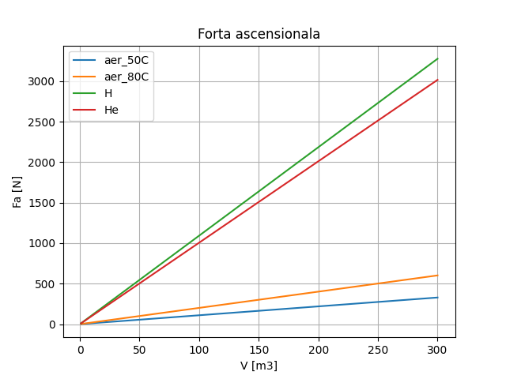
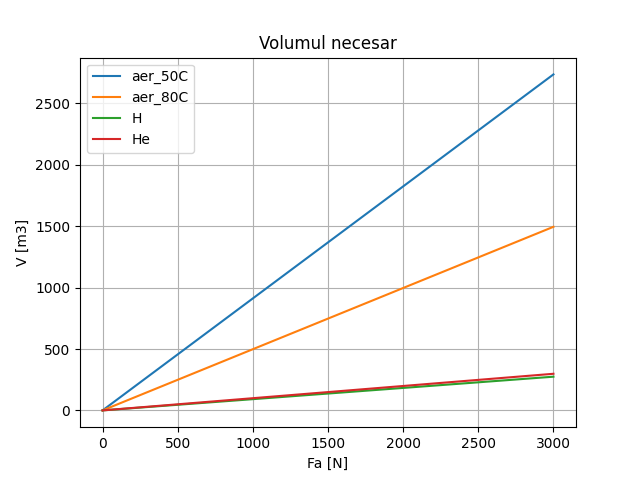

<head><link rel='stylesheet' href='../assets/style.css'></head>

# Capitolul 2. Fizica aerostatului

## 2.1 Principiul lui Arhimede

*Arhimede* a fost un renumit matematician și fizician grec, considerat unul dintre cei mai de seamă savanți din Antichitate. În fizică a stabilit legile pârghiilor și este autorul legii care-i poartă denumirea.

Legea lui Arhimede: *"Asupra unui corp scufundat în lichid (sau în gaz) acționează o forță orientată vertical în sus egală numeric cu ponderea lichidului (sau a gazului) dezlocuit de acest corp"*.

::: figure

**Fig. 2.1** Prezentarea funcționării legii lui Arhimede pe cale experimentală

[Fizica cl. 7]
:::

Funcționarea și logica legii lui Arhimede se poate observa la introducerea oricărui corp într-un vas cu lichid. Experimental putem lua un corp, paralelipiped drept scufundat într-un vas cu apă fig. 2.2. Pe suprafața superioară și cea inferioară vor acționa 2 forțe de sens contrar.

Asupra bazei de sus acționează forța $F_1$, iar pe baza de jos $F_2$:

::: equation
$F_1 = p_1\cdot S = \rho g h_1\cdot S ~~~ \text{și} ~~~ F_2 = p_2\cdot S = \rho g h_2\cdot S$
:::

Unde:

- $S$ - este aria bazei
- $h_1$ - înălțimea coloanei de apă la baza superioară
- $h_2$ - înălțimea coloanei de apă de la baza inferioară la nivelul liber al lichidului

::: figure

**Fig. 2.2** Paralelipiped drept scufundat într-un vas cu apă

[Fizica cl. 7]
:::

Observăm că $h_2 > h_1$, respectiv rezultă că $F_2 > F_1$, diferența acestor forțe ne va rezulta forța Arhimede:

::: equation
$F_A = F_2 - F_1 = \rho\cdot g\cdot S\cdot (h_2-h_1)$
:::

Unde:

- $F_A$ - notată forța Arhimede
- $\rho$ - densitatea lichidului
- $S\cdot(h_2 - h_1) \equiv V_d$ - volumul corpului, care este egal și cu volumul lichidului care îl dezlocuiește

Deci forța Arhimede poate fi rescrisă ca: $F_A = \rho\cdot g\cdot V_d$ (1)

## 2.2 Exemple de calcul a forței ascensionale

Având la bază legea lui Arhimede, putem deduce forța ascensională al unui corp umplut cu gaz care plutește în aer:

::: equation
$F_a = (\rho_a-\rho_g)\cdot g\cdot V$

(2)
:::

Unde:

- $F_a$ - forța ascensională
- $\rho_a$ - densitatea aerului în afara corpului
- $\rho_g$ - densitatea gazului din interiorul corpului
- $g$ - accelerația gravitațională
- $V$ - volumul corpului

Pentru calcule se vor utiliza următoarele constante:

::: table col-center col-2-left
|Symbol|Denumire|Valoare|U.M.|
|---|---|---|---|
|$P_{a}$|Presiunea absolută|101325|$Pa$|
|$\rho_{aer}$|Densitatea aerului din atmosfera la $20^\circ C$|1.20408|$kg/m^3$|
|$\rho_H$|Densitate hidrogen|0.0899|$kg/m^3$|
|$\rho_{He}$|Densitate heliu|0.1785|$kg/m^3$|
|$\rho_{a 50}$|Densitatea aerului încălzit la $50^\circ C$|1.0923|$kg/m^3$|
|$\rho_{a 80}$|Densitatea aerului încălzit la $80^\circ C$|0.9995|$kg/m^3$|
|$g$|Constanta gravitațională|9.80665|$m/s^2$|
:::

Se va efectua calculul pentru două cazuri, în ambele se va căuta cel mai eficient gaz dintre hidrogen, heliu, aer la 50${}^\circ C$ și aer la 80${}^\circ C$. Primul caz urmează determinarea forței ascensionale la volum impus, în al doilea caz se va determina volumul necesar pentru forța ascensională impusă. Calculele se efectuiază pentru un corp teoretic cu masă egală a aerului utilizat situat în atmosferă cu presiune de 1 bar și aer cald la 20${}^\circ C$.

### *Cazul 1*

Se determină $F_a = (\rho_a - \rho_g)\cdot g\cdot V$, unde $V = 1\div 300 ~~~ [\text{m}^3]$

::: figure

**Fig. 2.3** Forța ascensională pentru volum impus
:::

În fig. 2.3 se observă o creștere liniară, cu cea mai mare forță obținută pentru hidrogen și cea mai mică la aerul încălzit la 50${}^\circ C$. Respectiv volumul necesar pentru o forță impusă la toate cele 4 gaze se așteaptă la hidrogen cu valoarea cea mai mică.

### *Cazul 2*

Se determină $V = \frac{F_a}{(\rho_a - \rho_g)\cdot g}$, unde $F_a = 10\div 3000 ~~~ [\text{N}]$

::: figure

**Fig. 2.4** Volumul pentru forța ascensională impusă
:::

După cum și s-a așteptat, pozițiile sunt identice, cel mai mic volum este la hidrogen, iar cel mai mare la aerul încălzit la 50${}^\circ C$. Pe grafic se mai poate observa că la forțe ascensionale mari, aerul cu o temperatură de 50${}^\circ C$ este puțin eficient.

## 2.3 Comportarea aerostatelor la vant lateral formule. exemple de calcul
